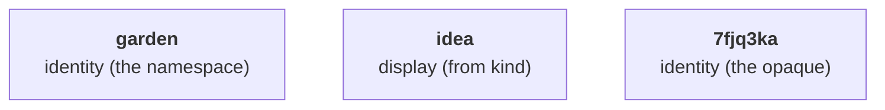

# Identifiers

Note IDs are composed of three colon-separated segments:

```
id = namespace:kind:opaque
```

Example: `garden:idea:7fjq3ka`.

## Anatomy



## The namespace

The namespace names the one body of work whose notes the corpus holds, declared once for the whole corpus.

> [!IMPORTANT]
> Renaming it later may break citations fixed in commit history or someone else's notes citing yours under the old name, so choose it as if it were permanent.

Choose it short, lowercase, and distinctive. It partitions the identity space: notes in distinct namespaces never collide, but two corpora that chose the same name can't be brought into one working context without their ids meaning two things at once.

> [!TIP]
> Anchor it to a name already registered to you, a domain or a repository, to reduce the probability of collisions with other corpora.

## The kind

The note's `kind` field is authoritative. The id's segment is just a rendering of it.
Every kind has exactly one segment, a short form no other kind shares.

A wrong segment is a display defect, not a naming change: it never changes which note the id names.
Fix it from the note's `kind`, wherever you can still edit the spelling.
Where you can't, a commit message for instance, leave it: that's history, not a defect.
To find every mention of a note, match on namespace and opaque, never on the full spelling. A wrong segment could hide a match.

An undefined `kind` still makes a valid note. Write the full token in `kind`, pick your own abbreviation for the segment, and treat that abbreviation as provisional: once the kind is formally defined, its canonical segment wins.

## The opaque

The opaque is a Crockford Base32 string, lowercase, compared case-insensitively:

```
0123456789abcdefghjkmnpqrstvwxyz
```

(`i`, `l`, `o` and `u` are excluded.)
It is unique within its namespace across every kind.

Its default length is seven characters.

Each corpus configures its own length, and the declared length governs new ids only.

Mixed lengths are lawful within one namespace: opaques of different lengths never collide. So raising the length widens the space for new ids with no re-mint.

> [!NOTE]
> Curious why an opaque id, or why these characters are left out? See [Why opaque ids](../guide/why-opaque-ids.md).

## Comparing ids

Two ids name the same note exactly when their namespaces and their opaques are equal, the opaques compared case-insensitively.

The segment plays no part in equality.

## Immutability

An id is minted once and never changes: not on a move, not on a rename, not on a revision.

## Minting by hand

1. Draw the opaque's characters from the alphabet above.
2. Confirm the string appears nowhere the namespace's notes are kept: `grep -r` in every repository holding them, and silence means it is free.
3. Assemble the namespace, the segment rendered from the note's `kind`, and the opaque.

A tool draws from a secure random source and checks the same way.
