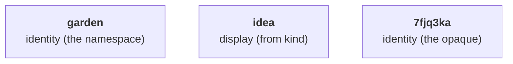

# Identifiers

An id names one note, permanently.
It is three colon-separated segments:

```
id = namespace ":" kind-segment ":" opaque
```

Example: `garden:idea:7fjq3ka`.

## Anatomy



In words: the outer segments, the namespace and the opaque, are the identity; the middle segment is display, rendered from the note's `kind`.

## The namespace

The namespace names the one body of work whose notes the corpus holds, declared once for the whole corpus.

Choose it short, lowercase, and distinctive, because it partitions the identity space: distinct bodies of work under distinct namespaces never collide, and two that chose the same name cannot be brought into one working context without their ids meaning two things at once.

Anchoring it to something already globally registered that you control, a domain or a repository, removes that collision for free.

Renaming it later is a mechanical find-and-replace in everything you can edit, your notes and your code included; the opaques survive unchanged.
What it breaks is everything you cannot edit: citations already fixed in commit history, and citations held by other people's work.
Choose it as if it were permanent.

## The kind segment

The note's `kind` field is authoritative; the segment in the id is rendered from it.
Every kind carries exactly one segment, a short form no other kind shares.

A segment disagreeing with `kind` is a display defect, repaired from the note's own `kind`; it never changes which note the id names.

A well-formed kind token nothing yet defines still makes a note; the unknown token is a warning, never a bar on the file.

## The opaque

The opaque is a Crockford Base32 string, lowercase, compared case-insensitively:

```
0123456789abcdefghjkmnpqrstvwxyz
```

(`i`, `l`, `o` and `u` are excluded.)
It is unique within its namespace across every kind.

Its default length is seven characters; each corpus configures its own length, and the declared length governs new ids only.
Mixed lengths are lawful within one namespace, and two opaques of different lengths never collide, so raising the length widens the space for new ids with no re-mint.

## Equality

Two ids name the same note exactly when their namespaces and their opaques are equal, the opaques compared case-insensitively.
The segment plays no part in equality.

## Immutability

An id is minted once and never changes: not on a move, not on a rename, not on a revision.

## Minting by hand

1. Draw the opaque's characters from the alphabet above.
2. Confirm the string appears nowhere the namespace's notes are kept: `grep -r` in every repository holding them, and silence means it is free.
3. Assemble the namespace, the segment rendered from the note's `kind`, and the opaque.

A tool draws from a secure random source and checks the same way.
