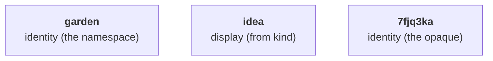

# Identifiers

Note IDs are composed of three colon-separated segments:

```
id = namespace:kind:opaque
```

Example: `garden:idea:7fjq3ka`.

## Anatomy



## The namespace

The namespace names the one body of work whose notes the corpus holds, declared once for the whole corpus.

> [!IMPORTANT]
> Renaming it later may break citations fixed in commit history or someone else's notes citing yours under the old name, so choose it as if it were permanent.

Choose it short, lowercase, and distinctive, because it partitions the identity space: distinct bodies of work under distinct namespaces never collide, and two that chose the same name cannot be brought into one working context without their ids meaning two things at once.

> [!TIP]
> Anchor it to a name already registered to you, a domain or a repository, to reduce the probability of collisions with other corpora.

## The kind

The note's `kind` field is authoritative; the segment in the id is rendered from it.
Every kind carries exactly one segment, a short form no other kind shares.

A segment disagreeing with `kind` is a display defect, repaired from the note's own `kind` wherever the spelling can be edited; it never changes which note the id names.
A segment already fixed where you cannot edit, a commit message for instance, keeps the kind the note had when cited; it is history, not a defect, and is never rewritten.
To find every mention of a note, match the namespace and the opaque, never the full spelling, which a wrong segment could hide.

A well-formed kind token nothing yet defines still makes a note; the unknown token is a warning, never a bar on the file.
For such a kind, write the full token in `kind` and choose your own abbreviation for the id; your choice is provisional until the kind is defined, and the defined one is then canonical.

## The opaque

The opaque is a Crockford Base32 string, lowercase, compared case-insensitively:

```
0123456789abcdefghjkmnpqrstvwxyz
```

(`i`, `l`, `o` and `u` are excluded.)
It is unique within its namespace across every kind.

Its default length is seven characters.

Each corpus configures its own length, and the declared length governs new ids only.

Mixed lengths are lawful within one namespace, and two opaques of different lengths never collide, so raising the length widens the space for new ids with no re-mint.

> [!NOTE]
> Curious why an opaque id, or why these characters are left out? See [Why opaque ids](../explanation/why-opaque-ids.md).

## Comparing ids

Two ids name the same note exactly when their namespaces and their opaques are equal, the opaques compared case-insensitively.

The segment plays no part in equality.

## Immutability

An id is minted once and never changes: not on a move, not on a rename, not on a revision.

## Minting by hand

1. Draw the opaque's characters from the alphabet above.
2. Confirm the string appears nowhere the namespace's notes are kept: `grep -r` in every repository holding them, and silence means it is free.
3. Assemble the namespace, the segment rendered from the note's `kind`, and the opaque.

A tool draws from a secure random source and checks the same way.
